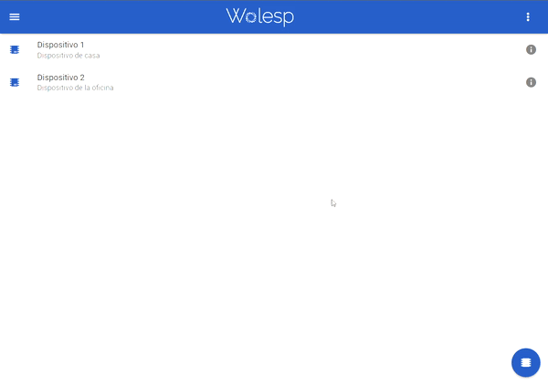

# WOLESP

<!-- PROJECT LOGO -->
<br />
<div align="center">
  <a href="https://github.com/XabiFran/WoLesp32">
    
  </a>

<h3 align="center">WOLESP</h3>

  <p align="center">
    TFG USAL.
    <br />
    <a href="https://github.com/XabiFran/WoLesp32"><strong>Explore the docs »</strong></a>
    <br />
    <br />
    <a href="https://github.com/XabiFran/WoLesp32/issues">Report Bug</a>
    ·
    <a href="https://github.com/XabiFran/WoLesp32/issues">Request Feature</a>
  </p>
</div>


<!-- ABOUT THE PROJECT -->
## Sobre el proyecto
Aplicación web desarrollada en Vue.js para monitorizar el encendido de ordenadores a través de un microcontrolador ESP32.
El repositorio del código del ESP32 se encuentra aquí: <a href="https://github.com/XabiFran/WOLESP-ESP32Broker">WOLESP ESP32</a>


### Construido con

* [](https://nodejs.org/es)
* [](https://developer.mozilla.org/es/docs/Web/JavaScript)
* [![Vue][Vue.js]][Vue-url]
* [](https://firebase.google.com)


# Instalación
## Setup
Para poder desplegar la aplicación es necesario instalar en el equipo Node.js y Npm. Para ello se ejecutará:
```
sudo npm install nodejs
sudo apt install npm
```
Una vez instalado, se ubica en el directorio del proyecto y se ejecuta el comando:
```
npm install
```
Para compilar y lanzar la aplicación para su desarrollo
```
npm run serve
```
Para compilar y reducir la aplicación para su producción
```
npm run build
```

## Firebase
Para poder utilizar las utilidades de Firebase y poder actualizar la aplicación hosteada será necesario instalar Firebase CLI. Para ello se ejecutarán los siguientes comandos:
```
npm install -g firebase-tools
firebase login
firebase init (seleccionando hosting y cloud functions)
firebase deploy
```
<!-- USAGE EXAMPLES -->
## Demostración

En esta pequeña demostración se muestra el inicio de sesión de un usuario, y las acciones necesarias para encender un equipo de manera remota.




<!-- CONTACT -->
## Contact

Javier Fran Abadía - javifran99@usal.es

Project Link: [https://github.com/XabiFran/WoLesp32](https://github.com/XabiFran/WoLesp32)


<!-- MARKDOWN LINKS & IMAGES -->
<!-- https://www.markdownguide.org/basic-syntax/#reference-style-links -->
[contributors-shield]: https://img.shields.io/github/contributors/github_username/repo_name.svg?style=for-the-badge
[contributors-url]: https://github.com/github_username/repo_name/graphs/contributors
[forks-shield]: https://img.shields.io/github/forks/github_username/repo_name.svg?style=for-the-badge
[forks-url]: https://github.com/github_username/repo_name/network/members
[stars-shield]: https://img.shields.io/github/stars/github_username/repo_name.svg?style=for-the-badge
[stars-url]: https://github.com/github_username/repo_name/stargazers
[issues-shield]: https://img.shields.io/github/issues/github_username/repo_name.svg?style=for-the-badge
[issues-url]: https://github.com/github_username/repo_name/issues
[license-shield]: https://img.shields.io/github/license/github_username/repo_name.svg?style=for-the-badge
[license-url]: https://github.com/github_username/repo_name/blob/master/LICENSE.txt
[linkedin-shield]: https://img.shields.io/badge/-LinkedIn-black.svg?style=for-the-badge&logo=linkedin&colorB=555
[linkedin-url]: https://linkedin.com/in/linkedin_username
[product-screenshot]: images/screenshot.png
[Next.js]: https://img.shields.io/badge/next.js-000000?style=for-the-badge&logo=nextdotjs&logoColor=white
[Next-url]: https://nextjs.org/
[React.js]: https://img.shields.io/badge/React-20232A?style=for-the-badge&logo=react&logoColor=61DAFB
[React-url]: https://reactjs.org/
[Vue.js]: https://img.shields.io/badge/Vue.js-35495E?style=for-the-badge&logo=vuedotjs&logoColor=4FC08D
[Vue-url]: https://vuejs.org/
[Angular.io]: https://img.shields.io/badge/Angular-DD0031?style=for-the-badge&logo=angular&logoColor=white
[Angular-url]: https://angular.io/
[Svelte.dev]: https://img.shields.io/badge/Svelte-4A4A55?style=for-the-badge&logo=svelte&logoColor=FF3E00
[Svelte-url]: https://svelte.dev/
[Laravel.com]: https://img.shields.io/badge/Laravel-FF2D20?style=for-the-badge&logo=laravel&logoColor=white
[Laravel-url]: https://laravel.com
[Bootstrap.com]: https://img.shields.io/badge/Bootstrap-563D7C?style=for-the-badge&logo=bootstrap&logoColor=white
[Bootstrap-url]: https://getbootstrap.com
[JQuery.com]: https://img.shields.io/badge/jQuery-0769AD?style=for-the-badge&logo=jquery&logoColor=white
[JQuery-url]: https://jquery.com 
